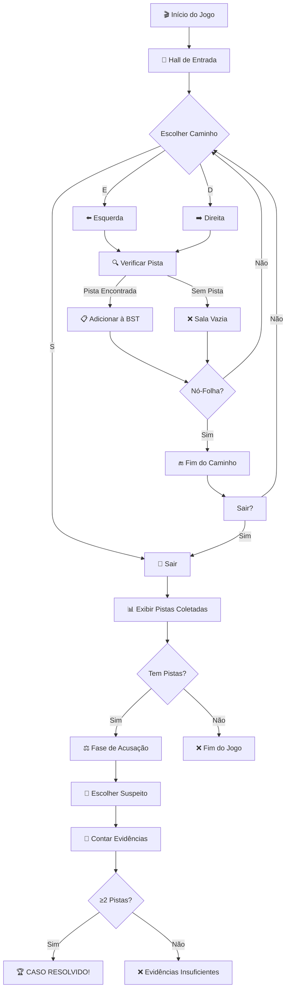

<div align="center">


# 🕵️‍♂️ DETECTIVE QUEST - Sistema de Investigação

### *Explore a mansão misteriosa, colete pistas e desvende o crime!*

[](https://en.wikipedia.org/wiki/C_(programming_language))
[](https://www.microsoft.com/windows)
[](https://github.com)

**Trabalho Acadêmico - Faculdade Estácio**

---

</div>

## 📖 Sobre o Projeto

Implementação completa de um **sistema de exploração e investigação** inspirado em jogos de detetive, desenvolvido em linguagem C para a disciplina de **Estruturas de Dados** da **Faculdade Estácio**. O projeto evolui através de três níveis progressivos, aplicando desde árvores binárias básicas até estruturas avançadas como BST e Tabelas Hash.

<div align="center">

### 🎯 Conceitos Aplicados

| 🌳 Estruturas | 🔍 Algoritmos | 🧮 Análise |
|:-------------:|:-------------:|:----------:|
| Árvore Binária | Percurso In-Order | Recursividade |
| BST (Binary Search Tree) | Inserção Ordenada | Complexidade |
| Tabela Hash | Hash Function | Colisões |
| Structs Aninhadas | Busca em BST | Performance |

</div>

---

## 🚀 Funcionalidades Principais

<table>
<tr>
<td width="50%" valign="top">

### 🏠 Exploração da Mansão
```
🚪 Navegação entre salas
🗺️ Mapa como árvore binária
🔦 Exploração interativa
🎯 Sistema de escolhas (E/D/S)
```

</td>
<td width="50%" valign="top">

### 🔍 Sistema de Pistas
```
📋 Coleta automática
🌲 Armazenamento em BST
📊 Ordenação alfabética
🎲 Tabela Hash de suspeitos
```

</td>
</tr>
</table>

### 🏆 Sistema de Acusação (Nível Mestre)

Sistema avançado de investigação com múltiplas estruturas de dados:

<div align="center">

| 🌳 Estrutura | 🎯 Função | ⚡ Complexidade |
|--------------|-----------|----------------|
| **Árvore Binária** | Mapa da Mansão | O(log n) navegação |
| **BST** | Pistas Ordenadas | O(log n) inserção |
| **Tabela Hash** | Pista → Suspeito | O(1) busca |
| **Contagem Recursiva** | Evidências por Suspeito | O(n) percurso |

</div>

---

## 🎯 Níveis de Desenvolvimento

<div align="center">

```
┌──────────────────────────────────────────────────────────────────┐
│                                                                  │
│  🟢 NOVATO  ──────▶  🟡 AVENTUREIRO  ──────▶  🔴 MESTRE        │
│                                                                  │
│  Exploração         Coleta de Pistas    Acusação + Hash        │
│  • Árvore Binária   • BST de Pistas     • Tabela Hash         │
│  • Navegação        • In-Order          • Contagem Recursiva   │
│  • Nós-Folha        • Auto-Insert       • Sistema Judicial     │
│                                                                  │
└──────────────────────────────────────────────────────────────────┘
```

</div>

<details>
<summary><b>🟢 Nível Novato - Exploração da Mansão</b></summary>

**Objetivo:** Implementar sistema de navegação pela mansão usando árvore binária

**Implementações:**
- Struct `Sala` com nome e ponteiros esquerda/direita
- Árvore binária representando o mapa
- Navegação interativa (E/D/S)
- Detecção de nós-folha (fim de caminho)

**Foco:** Sistema de exploração funcional com mapa fixo

```c
typedef struct Sala {
    char nome[50];
    struct Sala* esquerda;
    struct Sala* direita;
} Sala;
```

**Funcionalidades:**
- ✅ Criar salas dinamicamente (`malloc`)
- ✅ Navegar pela mansão (escolhas do jogador)
- ✅ Exibir sala atual
- ✅ Detectar fim de exploração

**Mapa Implementado:**
```
                Hall de Entrada
                /             \
        Sala de Estar      Biblioteca
         /        \          /        \
    Cozinha  Sala Jantar  Escritório  Sala Música
     /    \                  /              \
Despensa Adega         Cofre Secreto    Jardim Inverno
```

</details>

<details>
<summary><b>🟡 Nível Aventureiro - Sistema de Pistas</b></summary>

**Objetivo:** Adicionar coleta de pistas com BST ordenada

**Implementações:**
- Struct `PistaNode` para árvore BST
- Campo `pista` em cada sala
- Inserção automática ao explorar
- Exibição ordenada (in-order)

**Foco:** Sistema completo de exploração + coleta

```c
typedef struct Sala {
    char nome[50];
    char pista[100];  // Nova!
    struct Sala* esquerda;
    struct Sala* direita;
} Sala;

typedef struct PistaNode {
    char pista[100];
    struct PistaNode* esquerda;
    struct PistaNode* direita;
} PistaNode;
```

**Pistas na Mansão:**
- 🔎 "Pegadas molhadas no chão" (Hall)
- 📖 "Livro aberto sobre a mesa" (Sala de Estar)
- 🔪 "Faca suja na pia" (Cozinha)
- 🍷 "Garrafa de vinho vazia" (Adega)
- 📄 "Documento confidencial" (Cofre Secreto)
- E mais...

**Algoritmos:**
- **Inserção BST:** O(log n) médio, O(n) pior caso
- **Percurso In-Order:** O(n) exibe alfabeticamente
- **Busca:** O(log n) na árvore balanceada

</details>

<details>
<summary><b>🔴 Nível Mestre - Sistema de Acusação</b></summary>

**Objetivo:** Sistema completo com tabela hash e julgamento final

**Implementações:**
- Struct `HashNode` para lista encadeada
- Tabela Hash associando pistas a suspeitos
- Função `funcaoHash()` para cálculo de índice
- Contagem recursiva de evidências
- Sistema de acusação com verificação

**Foco:** Jogo completo com resolução do mistério

```c
typedef struct HashNode {
    char pista[100];
    char suspeito[50];
    struct HashNode* proximo;
} HashNode;

typedef struct {
    HashNode* tabela[TAMANHO_HASH];
} TabelaHash;
```

**Suspeitos:**
| 👤 Suspeito | 🔍 Pistas Associadas |
|-------------|----------------------|
| **Mordomo** | 3 pistas (Carta, Piano, Documento) |
| **Cozinheira** | 2 pistas (Faca, Garrafa) |
| **Jardineiro** | 2 pistas (Pegadas, Flor) |
| **Bibliotecário** | 2 pistas (Livro, Estante) |

**Mecânica de Vitória:**
```
✅ Coletar pistas explorando a mansão
✅ Pistas são organizadas automaticamente (BST)
✅ Acusar um suspeito ao final
✅ Sistema verifica evidências (≥2 pistas)
🏆 Resolver o caso ou falhar na investigação
```

**Recursos Avançados:**
- 🔗 **Lista encadeada** para tratamento de colisões
- 🔢 **Função hash** simples (soma ASCII mod 10)
- 🌲 **Contagem recursiva** na BST
- ⚖️ **Sistema judicial** com threshold de provas

</details>

---

## 💻 Como Executar

### 📋 Pré-requisitos
- Compilador GCC (MinGW para Windows)
- Sistema operacional Windows
- Terminal com suporte UTF-8

### ⚙️ Compilação
```bash
gcc detective-quest-challenge.c -o detective-quest
```

### ▶️ Execução
```bash
.\detective-quest.exe
```

---

## 🎮 Como Usar

<div align="center">

### 🎯 Fluxo do Jogo



</div>

### 📊 Exemplo de Jogatina

```c
========================================
   BEM-VINDO AO DETECTIVE QUEST!
          NIVEL MESTRE
========================================
Explore a mansao, colete pistas e
descubra quem e o culpado!

========================================
Voce esta no(a): Hall de Entrada
========================================

[!] PISTA ENCONTRADA: Pegadas molhadas no chão
[+] Pista adicionada a coleção!

Escolha seu caminho:
  [E] - Ir para esquerda
  [D] - Ir para direita
  [S] - Sair da exploração

Opcao: d

========================================
Voce esta no(a): Biblioteca
========================================

[!] PISTA ENCONTRADA: Estante com livro faltando
[+] Pista adicionada a coleção!

Escolha seu caminho:
  [E] - Ir para esquerda
  [D] - Ir para direita
  [S] - Sair da exploração

Opcao: e

========================================
Voce esta no(a): Escritorio
========================================

[!] PISTA ENCONTRADA: Carta rasgada na lixeira
[+] Pista adicionada a coleção!

Escolha seu caminho:
  [E] - Ir para esquerda
  [S] - Sair da exploração

Opcao: e

========================================
Voce esta no(a): Cofre Secreto
========================================

[!] PISTA ENCONTRADA: Documento confidencial
[+] Pista adicionada a coleção!

-> Voce chegou ao final deste caminho!
-> Escolha [S] para sair e continuar a investigação.

Opcao: s

========================================
   PISTAS COLETADAS
========================================

Voce coletou as seguintes pistas:

  * Carta rasgada na lixeira
  * Documento confidencial
  * Estante com livro faltando
  * Pegadas molhadas no chão

========================================
   FASE FINAL: ACUSAÇÃO
========================================

Baseado nas pistas coletadas, quem e o culpado?

Suspeitos disponíveis:
  - Mordomo
  - Cozinheira
  - Jardineiro
  - Bibliotecário

Digite o nome do suspeito: Mordomo

========================================
   VERIFICANDO EVIDENCIAS...
========================================

Numero de pistas que apontam para Mordomo: 2

*** CASO RESOLVIDO! ***
Voce reuniu evidencias suficientes!
O culpado e realmente: Mordomo

Parabéns, detetive! A justiça foi feita!

========================================
Obrigado por jogar Detective Quest!
========================================
```

---

## 🏗️ Arquitetura do Código

<div align="center">

### 📦 Estruturas de Dados

</div>

```c
// Sala da mansão (Árvore Binária)
typedef struct Sala {
    char nome[50];         // Nome do cômodo
    struct Sala* esquerda; // Caminho esquerdo
    struct Sala* direita;  // Caminho direito
} Sala;

// Nó da BST de pistas (Nível Aventureiro+)
typedef struct PistaNode {
    char pista[100];              // Conteúdo da pista
    struct PistaNode* esquerda;   // Subárvore esquerda
    struct PistaNode* direita;    // Subárvore direita
} PistaNode;

// Nó da lista encadeada na Hash (Nível Mestre)
typedef struct HashNode {
    char pista[100];       // Chave: conteúdo da pista
    char suspeito[50];     // Valor: nome do suspeito
    struct HashNode* proximo; // Próximo nó (colisão)
} HashNode;

// Tabela Hash (Nível Mestre)
typedef struct {
    HashNode* tabela[TAMANHO_HASH]; // Array de listas
} TabelaHash;
```

<div align="center">

### 🔧 Funções Principais

</div>

<table>
<tr>
<th>Categoria</th>
<th>Função</th>
<th>Complexidade</th>
</tr>
<tr>
<td rowspan="3"><b>Árvore Binária</b></td>
<td><code>criarSala()</code></td>
<td>O(1)</td>
</tr>
<tr>
<td><code>explorarSalas()</code></td>
<td>O(h) - h=altura</td>
</tr>
<tr>
<td><code>liberarArvore()</code></td>
<td>O(n)</td>
</tr>
<tr>
<td rowspan="3"><b>BST de Pistas</b></td>
<td><code>inserirPista()</code></td>
<td>O(log n) médio</td>
</tr>
<tr>
<td><code>exibirPistas()</code></td>
<td>O(n)</td>
</tr>
<tr>
<td><code>contarPistasPorSuspeito()</code></td>
<td>O(n)</td>
</tr>
<tr>
<td rowspan="3"><b>Tabela Hash</b></td>
<td><code>funcaoHash()</code></td>
<td>O(k) - k=tamanho string</td>
</tr>
<tr>
<td><code>inserirNaHash()</code></td>
<td>O(1) médio</td>
</tr>
<tr>
<td><code>encontrarSuspeito()</code></td>
<td>O(1) médio</td>
</tr>
<tr>
<td rowspan="2"><b>Sistema de Jogo</b></td>
<td><code>obterPistaDaSala()</code></td>
<td>O(1)</td>
</tr>
<tr>
<td><code>verificarSuspeitoFinal()</code></td>
<td>O(n)</td>
</tr>
</table>

---

## ✅ Requisitos Atendidos

<div align="center">

### 🎯 Nível Novato

| Requisito | Implementação | Status |
|:---------:|:-------------:|:------:|
| **Árvore Binária** | Mapa da mansão | ✅ |
| **Struct Sala** | nome, esq, dir | ✅ |
| **Navegação** | E/D/S interativa | ✅ |
| **Detecção Nó-Folha** | Fim de caminho | ✅ |
| **Alocação Dinâmica** | malloc() e free() | ✅ |
| **Interface** | Mensagens claras | ✅ |

### 🎯 Nível Aventureiro

| Requisito | Implementação | Status |
|:---------:|:-------------:|:------:|
| **BST de Pistas** | Ordenação automática | ✅ |
| **Campo Pista** | Em cada sala | ✅ |
| **Inserção BST** | Ordenada alfabética | ✅ |
| **Coleta Auto** | Durante exploração | ✅ |
| **Exibição In-Order** | Pistas ordenadas | ✅ |
| **Recursividade** | Percurso BST | ✅ |

### 🎯 Nível Mestre

| Requisito | Implementação | Status |
|:---------:|:-------------:|:------:|
| **Tabela Hash** | Pista → Suspeito | ✅ |
| **Função Hash** | Soma ASCII mod 10 | ✅ |
| **Lista Encadeada** | Tratamento colisões | ✅ |
| **4 Suspeitos** | Mapeamento completo | ✅ |
| **Contagem Recursiva** | Evidências/suspeito | ✅ |
| **Sistema Judicial** | ≥2 pistas p/ resolver | ✅ |
| **Fase Final** | Acusação interativa | ✅ |
| **Gerenciamento Memória** | free() completo | ✅ |

</div>

---

## 🛠️ Stack Tecnológica

<div align="center">


### 📚 Bibliotecas Utilizadas

`stdio.h` • `stdlib.h` • `string.h` • `windows.h`

</div>

---

## 🎨 Diferenciais do Projeto

<div align="center">

| 🌟 Feature | 📝 Descrição |
|-----------|-------------|
| **3 Estruturas Integradas** | Árvore Binária + BST + Hash |
| **Sistema de Jogo Completo** | Exploração + Investigação + Acusação |
| **Algoritmo Hash Eficiente** | O(1) busca de suspeitos |
| **Recursividade Aplicada** | Percurso, contagem, liberação |
| **Interface Imersiva** | Narrativa de detetive |
| **Código Modular** | Funções bem definidas |
| **Zero Memory Leaks** | free() em todas as estruturas |
| **UTF-8 Completo** | Acentuação portuguesa |

</div>

### 🎮 Sistema de Pistas Implementado

```
╔════════════════════════════════════════╗
║     MAPEAMENTO PISTAS → SUSPEITOS      ║
╠════════════════════════════════════════╣
║                                        ║
║  Mordomo (3 pistas - CULPADO!)       ║
║    • Carta rasgada na lixeira          ║
║    • Piano desafinado                  ║
║    • Documento confidencial            ║
║                                        ║
║  Cozinheira (2 pistas)                 ║
║    • Faca suja na pia                  ║
║    • Garrafa de vinho vazia            ║
║                                        ║
║  Jardineiro (2 pistas)                 ║
║    • Pegadas molhadas no chão          ║
║    • Flor exótica arrancada            ║
║                                        ║
║  Bibliotecário (2 pistas)              ║
║    • Livro aberto sobre a mesa         ║
║    • Estante com livro faltando        ║
║                                        ║
╚════════════════════════════════════════╝
```

---

## 📈 Análise de Complexidade

<div align="center">

### ⚡ Performance das Estruturas

| Estrutura | Inserção | Busca | Remoção | Memória |
|-----------|----------|-------|---------|---------|
| **Árvore Binária** | N/A | O(h) | N/A | O(n) |
| **BST** | O(log n)* | O(log n)* | O(log n)* | O(n) |
| **Tabela Hash** | O(1)** | O(1)** | O(1)** | O(m+n) |

\* Médio caso (árvore balanceada)  
\** Médio caso (poucas colisões)

### 🎯 Vantagens de Cada Estrutura

```
ÁRVORE BINÁRIA (Mapa)
  ✓ Representação natural do layout
  ✓ Navegação intuitiva (esq/dir)
  ✓ Estrutura fixa e previsível

BST (Pistas)
  ✓ Ordenação automática
  ✓ Exibição alfabética sem sort
  ✓ Inserção eficiente O(log n)

TABELA HASH (Suspeitos)
  ✓ Busca instantânea O(1)
  ✓ Associação direta pista→suspeito
  ✓ Escalável para muitos suspeitos
```

</div>

---

## 🎓 Informações Acadêmicas

**Instituição:** Faculdade Estácio  
**Disciplina:** Estruturas de Dados  
**Linguagem:** C (C99)  
**Paradigma:** Programação Estruturada  
**Conceitos:** Árvores, BST, Tabelas Hash, Recursividade, Alocação Dinâmica

---

## 📝 Aprendizados do Projeto

<div align="center">

```
┌─────────────────────────────────────────────────────────┐
│                                                         │
│  📚 CONCEITOS CONSOLIDADOS                              │
│                                                         │
│  ✓ Árvores Binárias (estrutura e navegação)            │
│  ✓ Binary Search Tree (inserção ordenada)              │
│  ✓ Tabelas Hash (função hash e colisões)               │
│  ✓ Listas Encadeadas (tratamento de colisões)          │
│  ✓ Recursividade (percurso, contagem, liberação)       │
│  ✓ Alocação Dinâmica (malloc, free)                    │
│  ✓ Structs Aninhadas (ponteiros complexos)             │
│  ✓ Percurso In-Order (ordenação natural)               │
│  ✓ Gerenciamento de Memória (prevenção leaks)          │
│  ✓ Integração de Estruturas (árvore + BST + hash)      │
│                                                         │
└─────────────────────────────────────────────────────────┘
```

</div>

### 🧠 Desafios Superados

<table>
<tr>
<th width="30%">Desafio</th>
<th width="70%">Solução Implementada</th>
</tr>
<tr>
<td><b>🌳 Navegação em Árvore</b></td>
<td>Sistema de escolhas (E/D/S) com validação de caminhos válidos</td>
</tr>
<tr>
<td><b>📋 Ordenação Automática</b></td>
<td>BST com inserção recursiva mantém ordem alfabética</td>
</tr>
<tr>
<td><b>🔗 Colisões na Hash</b></td>
<td>Lista encadeada em cada índice resolve colisões eficientemente</td>
</tr>
<tr>
<td><b>🔢 Contagem de Evidências</b></td>
<td>Função recursiva percorre BST e conta matches na hash</td>
</tr>
<tr>
<td><b>💾 Memory Leaks</b></td>
<td>Funções `liberar*()` recursivas garantem free() completo</td>
</tr>
</table>

---

## 🎮 Estratégias de Jogo

<div align="center">

### 🏆 Como Resolver o Caso

```
┌───────────────────────────────────────────┐
│  1️⃣ EXPLORE TODAS AS SALAS               │
│     → Maximize a coleta de pistas         │
│                                           │
│  2️⃣ PRIORIZE CAMINHOS PROFUNDOS          │
│     → Nós-folha geralmente têm pistas     │
│                                           │
│  3️⃣ ANOTE PISTAS MENTALMENTE             │
│     → Relacione com ações dos suspeitos   │
│                                           │
│  4️⃣ ACUSE COM ≥2 EVIDÊNCIAS              │
│     → Sistema exige prova suficiente      │
│                                           │
│  5️⃣ ANALISE A LISTA ORDENADA             │
│     → BST mostra todas alfabeticamente    │
│                                           │
└───────────────────────────────────────────┘
```

### 🎯 Dica: Mapa Completo

```
                  Hall de Entrada [Pegadas]
                  /                         \
        Sala de Estar [Livro]          Biblioteca [Estante]
         /              \                /              \
  Cozinha [Faca]  Sala Jantar []  Escritório [Carta]  Sala Música [Piano]
    /        \                         /                        \
Despensa []  Adega [Garrafa]  Cofre [Documento]         Jardim [Flor]

LEGENDA:
[] = Sem pista
[Texto] = Pista disponível
Total: 9 pistas distribuídas
```

</div>

---

<div align="center">

### 📄 Licença

Este projeto foi desenvolvido exclusivamente para fins educacionais.

---

### 💜 Desenvolvido com dedicação

*"Árvores não são apenas estruturas de dados, são mapas para resolver mistérios."*

⭐ **Se este projeto ajudou nos seus estudos, considere deixar uma estrela!**

---

**[⬆ Voltar ao topo](#-detective-quest---sistema-de-investigação)**

</div>